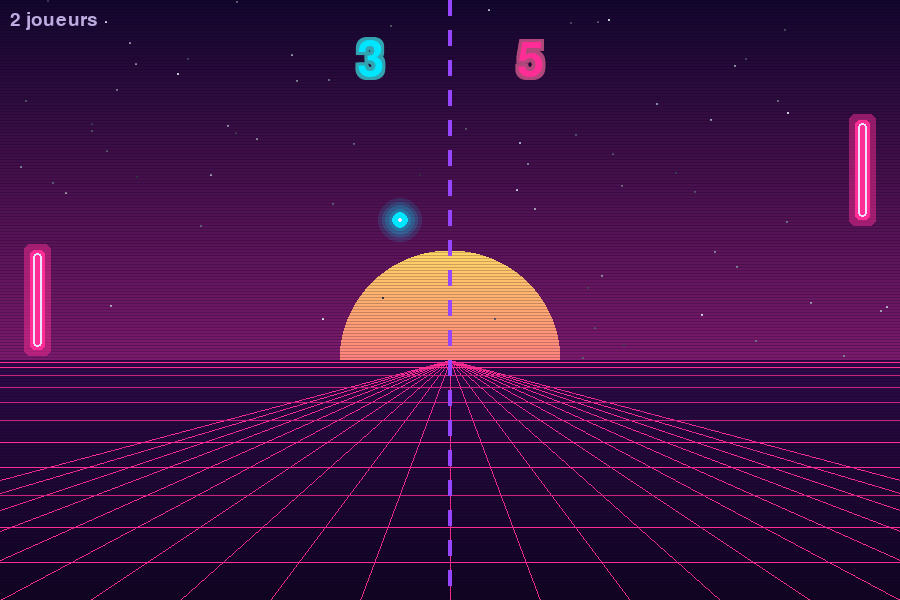

# 12 — Le style rétro synthwave

Jusqu'ici, nous avons construit un Pong fonctionnel sur fond noir. Ce chapitre lui
donne une identité visuelle **rétro synthwave** : ciel en dégradé, soleil couchant,
grille en perspective, étoiles scintillantes, scanlines et **halos néon**.



Point important : **aucune ligne de logique de jeu n'a changé**. Physique, IA, score
et scènes continuent de fonctionner exactement pareil. On ne touche qu'au **calque
d'affichage** — c'est tout l'intérêt d'avoir séparé le rendu de la logique.

## La palette

On ajoute les couleurs du thème à `pong/settings.py`, sans toucher aux anciennes :

```python
# --- Thème rétro synthwave ---
HORIZON_Y = 360                 # hauteur de l'horizon
SKY_TOP = (18, 6, 46)           # ciel en haut
SKY_HORIZON = (122, 26, 108)    # ciel près de l'horizon
GROUND_FAR = (44, 10, 72)       # sol sous l'horizon
GROUND_NEAR = (16, 4, 34)       # sol en bas
SUN_RADIUS = 110
SUN_TOP = (255, 214, 102)       # haut du soleil (jaune)
SUN_BOTTOM = (255, 45, 149)     # bas du soleil (rose)
GRID_COLOR = (255, 45, 149)     # grille néon
NEON_PINK = (255, 45, 149)
NEON_CYAN = (0, 229, 255)
NEON_PURPLE = (150, 70, 255)
NEON_YELLOW = (255, 214, 102)
TEXT_COLOR = (236, 226, 255)
TEXT_DIM = (188, 172, 224)
```

## Le module `pong/synthwave.py`

Tout le décor vit dans un module dédié. On y trouve d'abord des **fonctions pures**,
c'est-à-dire de simples calculs sans effet graphique — donc **testables sans écran**.

### Interpoler des couleurs

```python
def lerp(a, b, t):
    return a + (b - a) * t

def lerp_color(color_a, color_b, t):
    return tuple(int(round(lerp(color_a[i], color_b[i], t))) for i in range(3))
```

On s'en sert pour les dégradés (ciel, sol, soleil) : on mélange deux couleurs selon
un facteur `t` entre 0 et 1.

### La grille en perspective

```python
def horizontal_grid_ys(horizon_y, height, count):
    ys = []
    span = height - horizon_y
    for i in range(1, count + 1):
        ys.append(int(round(horizon_y + span * (i / count) ** 2)))
    return ys
```

L'astuce est le **carré** (`** 2`) : les lignes s'espacent de plus en plus en
s'éloignant de l'horizon, ce qui crée l'illusion de profondeur.

```python
def vertical_grid_segments(cx, horizon_y, width, height, spacing):
    segments = []
    k = 0
    while k * spacing <= width:
        offset = k * spacing
        segments.append(((int(cx), int(horizon_y)), (int(cx + offset), int(height))))
        if offset:
            segments.append(((int(cx), int(horizon_y)), (int(cx - offset), int(height))))
        k += 1
    return segments
```

Les lignes verticales partent du **point de fuite** `(cx, horizon_y)` et s'écartent vers
le bas : c'est la fameuse grille « autoroute des années 80 ».

### Les étoiles et la pulsation

```python
def generate_stars(count, width, sky_height, seed=0):
    rng = random.Random(seed)
    return [(rng.uniform(0, width), rng.uniform(0, sky_height), rng.uniform(0.4, 1.0))
            for _ in range(count)]

def sun_pulse(time):
    return 1.0 + 0.03 * math.sin(time * 1.5)
```

`generate_stars` utilise un générateur aléatoire **à graine fixe** : le champ d'étoiles
est identique à chaque lancement (et donc reproductible dans les tests). `sun_pulse`
donne un facteur proche de 1, qui varie doucement : le soleil « respire ».

> **TDD** : ces cinq fonctions sont testées dans `tests/test_synthwave.py`
> (bornes de la grille, déterminisme des étoiles, amplitude de la pulsation).

## Le décor : `SynthwaveBackground`

La classe assemble les couches. Les parties **statiques** (ciel, sol, soleil, scanlines)
sont rendues **une seule fois** dans le constructeur, pour ne pas les recalculer à
chaque image :

```python
class SynthwaveBackground:
    def __init__(self, width=settings.WINDOW_WIDTH, height=settings.WINDOW_HEIGHT):
        ...
        self._sky = self._render_sky()
        self._ground = self._render_ground()
        self._sun = self._render_sun()
        self._scanlines = self._render_scanlines()
        self._stars = generate_stars(settings.STAR_COUNT, width, self.horizon_y, seed=7)
```

Dessiner en chaque image :

```python
def draw(self, surface, time):
    surface.blit(self._sky, (0, 0))

    # Soleil pulsant, centré sur l'horizon.
    pulse = sun_pulse(time)
    sun = pygame.transform.smoothscale(self._sun, (int(self._sun.get_width() * pulse),
                                                   int(self._sun.get_height() * pulse)))
    surface.blit(sun, (self.width // 2 - sun.get_width() // 2,
                       self.horizon_y - sun.get_height() // 2))

    # Le sol recouvre la moitié basse du soleil, puis la grille passe devant.
    surface.blit(self._ground, (0, self.horizon_y))
    self._draw_grid(surface)
    self._draw_stars(surface, time)
    surface.blit(self._scanlines, (0, 0))
```

L'**ordre des couches** est essentiel : ciel → soleil → sol → grille → étoiles →
scanlines. C'est ce qui place le soleil *derrière* la grille.

Le soleil se construit ligne par ligne, avec des **bandes horizontales** de plus en
plus larges vers le bas (le fameux soleil « coupé ») :

```python
band_y = radius + int(radius * 0.1)
gap = 3
while band_y < radius * 2:
    dy = band_y - radius
    half = math.sqrt(max(0.0, radius * radius - dy * dy))
    if half > 0:
        pygame.draw.line(surface, (*settings.SKY_HORIZON, 255),
                         (radius - half, band_y), (radius + half, band_y))
    band_y += gap
    gap += 1
```

## Les halos néon

Pour faire « briller » la balle et les raquettes, on superpose plusieurs formes
concentriques d'opacité décroissante sur une surface transparente :

```python
def glow_circle(surface, center, radius, color, spread=10, layers=4, max_alpha=120):
    size = int((radius + spread) * 2)
    glow = pygame.Surface((size, size), pygame.SRCALPHA)
    middle = size // 2
    for layer in range(layers, 0, -1):
        r = int(radius + spread * (layer / layers))
        alpha = int(max_alpha * (1 - (layer - 1) / layers))
        pygame.draw.circle(glow, (*color[:3], alpha), (middle, middle), r)
    surface.blit(glow, (int(center[0]) - middle, int(center[1]) - middle))
```

`glow_rect` fait la même chose pour les raquettes, et `glow_text` ajoute un halo
autour du texte (on dessine plusieurs copies légèrement décalées avant la version nette).

## Intégration dans les scènes

`App` crée **une seule** instance du décor et la partage :

```python
self.background = SynthwaveBackground()
```

Chaque scène l'utilise en début de `draw`, puis dessine par-dessus :

```python
def draw(self, surface):
    self.app.background.draw(surface, pygame.time.get_ticks() / 1000.0)
    self._draw_net(surface)
    self._draw_scores(surface)
    for paddle in (self.left_paddle, self.right_paddle):
        synthwave.glow_rect(surface, paddle.rect, settings.NEON_PINK)
        pygame.draw.rect(surface, settings.NEON_PINK, paddle.rect, border_radius=5)
    synthwave.glow_circle(surface, (self.ball.x, self.ball.y), self.ball.radius,
                          settings.NEON_CYAN, spread=14)
    pygame.draw.circle(surface, settings.NEON_CYAN,
                       (int(self.ball.x), int(self.ball.y)), self.ball.radius)
```

`pygame.time.get_ticks() / 1000.0` fournit le temps écoulé en secondes, utilisé pour
la pulsation du soleil et le scintillement des étoiles. Comme le décor est animé même
en pause, l'ambiance reste vivante.

> **Astuce lisibilité** : les écrans de menu et de fin affichent un **panneau
> translucide** (`pygame.Surface` + `set_alpha`) derrière le texte, sinon les options
> se perdent sur le soleil.

## Générer des aperçus

Le script `scripts/render_preview.py` dessine chaque écran hors ligne et enregistre des
PNG dans `docs/screenshots/` (sans ouvrir de fenêtre) :

```bash
python scripts/render_preview.py
```

C'est bien pratique pour illustrer le README ou vérifier un changement de style dans
la CI.

## Et le tutoriel dans tout ça ?

Les chapitres précédents construisent volontairement un thème **simple** (fond noir,
couleurs unies) : c'est la meilleure façon d'apprendre les mécanismes sans se perdre
dans l'esthétique. Ce chapitre-ci ajoute la couche de style **par-dessus**, sans rien
casser — exactement comme on procéderait sur un vrai projet.

---

[Retour au sommaire du tutoriel](README.md)
